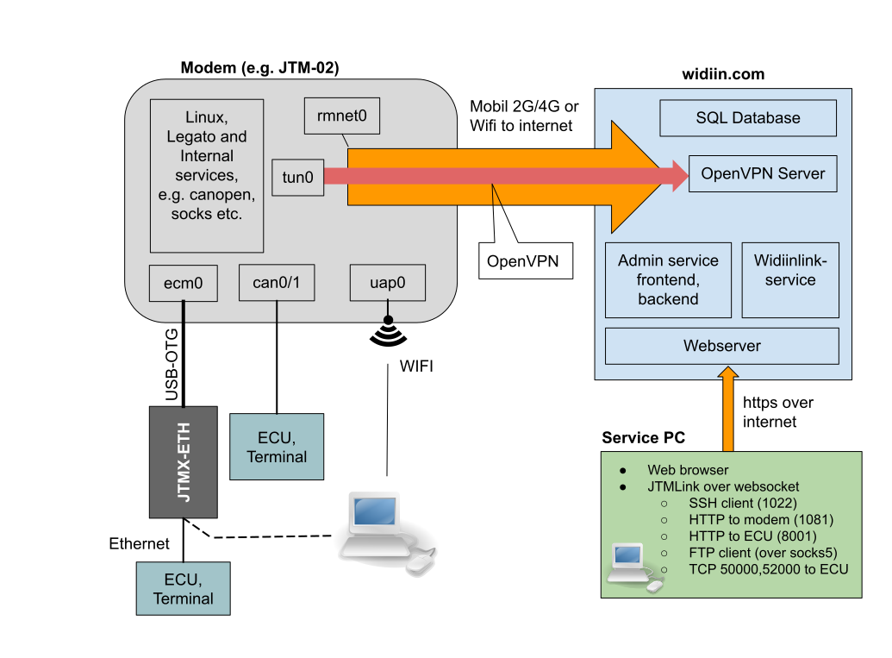
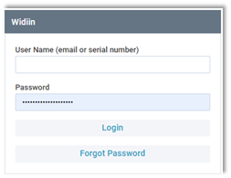
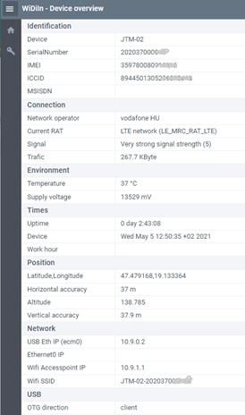
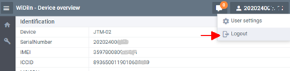

# Overview
This block diagram is the overview of the connection cannels and possible transfer methods:

#### Notes
*   The direction of the arrows shows the connection directions from the originator to the target. 
*   The JTM-02 immediately connects to the widiin server when it is powered. The connection is encrypted. 
*   “Internal services” in the JTM-02: file server, SSH server in (port: 22), web server (port: 80).
*   “Other Services”: 3rd party services, like the Time Server, AgriRouter or other servers.
*   Present documentation does not describe the internal interfaces, but these are also accessible.

## WiDiIn server functions
The modem status and the maintenance functions are accessible via the https://widiin.com site.
Every modem is connected to the Widiin server via the mobile network. 

*	The modem to server connection is encrypted and protected by individual encryption key. 
    The Modem keys are signed by the server key during the production time. Protocol: OpenVPN. 
*	The client to server connection is also encrypted. Protocol: https. The server’s key is signed. 

## Login
Online functions are accessible after log on the https://widiin.com site.
Login data (first time): Serial Number and the WiFi password (visible on the add-on label).
The registered users can be login by their email address and password. In this case the user can handle all of devices which are assigned to this operator’s account.

## Device overview
The device overview is visible after the valid authentication. The existing authentication process uses the device itself, therefore the overview will be visible if the device is online (accessible over the mobile network).
The list of data is not refreshing automatically for reducing the data traffic. The data content can be updating any time by the refresh function of the web browser. 

### Printed sections
- Identification:
    - Serial Number 
    - Modem’s IMEI: this number identifies the modem on the cellular network
    - ICCID: individual number of the SIM card
    - MSISDN is the phone number of the SIM card (accessible only if it is published)
- Connection: 
    - shows name of the mobile operator, type of network and the signal strength. 
    - The traffic is the sum of transferred data since start-up time
- Environment: 
    - measured inside temperature and the voltage of the power source.
- Time: 
    - the device local time, and the Uptime is the elapsed time since power-on. 
- Position: 
    - actual GNSS info. GNSS signal is necessary for the visible values.  
- Network: 
    - own IP addresses of the built-in interfaces. 
    - WiFi (the SSID is also accessible), 
    - USB interface. The “acm0” virtual network interface is accessible in client mode only. 
    - ETHERNET: this IP address is active if the external JTMX-ETH interface is present. 
- USB: 
    - actual direction of the OTG interface. The “client” mode is fit to the connection to PC

##	Logout
Exits form the actual session. The session also will be closed if the browser’s page is closed.

## Set public key
The JTM-02 uses the key based authentication for the root login. The user’s individual public key is necessary for the SSH connection to the modem. This function uploads and permanently stores the public key to the modem. The modem owner can stores one root access key in the modem. The new key inactivates the earlier issued root access. 

Must generate an SSH key pair before use of the root access function. In the Windows environment can be do it by the PuTTYgen (PuTTY Key Generator) program. 
It is accessible via the [https://www.putty.org](https://www.putty.org)  site. The SSH client (PuTTY.exe) also accessible here.
(See the details in the “SSH Connection” chapter.) The private key never leaves the operator’s PC. The public key is necessary for the connection via the SSH protocol. 

Testtest